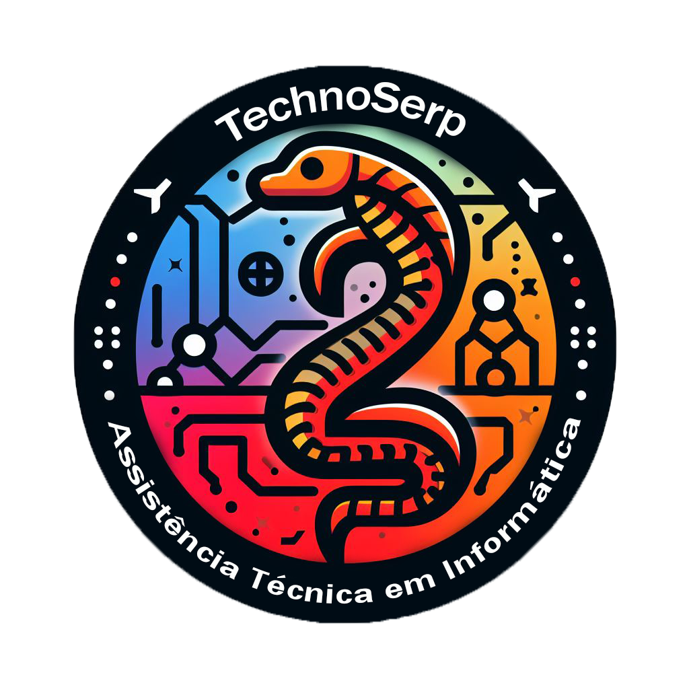

# 🚀 Portal TechnoSerp

  

<h3 align="center">
Intranet interna para centralização de sistemas, ferramentas e recursos da TechnoSerp.
</h3>

---

## 📌 Sobre o projeto

O **Portal TechnoSerp** é uma intranet interna desenvolvida para centralizar os principais acessos utilizados pela equipe.

A plataforma reúne sistemas, ferramentas, documentos e recursos importantes em um único ambiente, facilitando a rotina dos colaboradores e reduzindo o tempo gasto procurando informações e links espalhados em diferentes locais.

O portal foi pensado para ser a página inicial de referência dos computadores da equipe, oferecendo acesso rápido aos recursos essenciais do dia a dia.

---

## 🎯 Objetivo

Criar uma central de acesso simples, organizada e eficiente, permitindo que técnicos e colaboradores encontrem rapidamente tudo o que precisam para executar suas atividades.

Com o portal configurado como página inicial dos navegadores da equipe, os principais recursos da empresa ficam disponíveis desde o primeiro acesso ao computador.

---

## ✨ Funcionalidades

🔎 **Busca inteligente**
- Pesquisa rápida por sistemas, ferramentas e recursos.
- Destaque dos resultados encontrados.
- Abertura automática de categorias relacionadas.

📂 **Organização por categorias**
- Atendimento
- Administração
- Desenvolvimento e Programação
- Marketing
- Ferramentas Técnicas
- Sistemas

📌 **Menus expansíveis**
- Visualização dos principais acessos.
- Opção "Ver Tudo" para acessar recursos adicionais.

🎨 **Interface dinâmica**
- Animações suaves.
- Organização visual em cards.
- Ícones personalizados.
- Experiência simples e intuitiva.

---

## 🛠️ Tecnologias utilizadas

- HTML5
- CSS3
- JavaScript
- SVG Icons

---

## 🖥️ Visão do projeto

O **Portal TechnoSerp** funciona como uma intranet corporativa, atuando como um ponto central de navegação para os recursos internos da empresa.

A ideia é transformar a abertura do navegador em um momento de acesso imediato às ferramentas de trabalho, reunindo em uma única interface:

- Sistemas utilizados diariamente;
- Ferramentas técnicas;
- Documentações;
- Recursos administrativos;
- Canais de comunicação;
- Acessos importantes da empresa.

Com uma interface organizada e de fácil utilização, o portal melhora a produtividade da equipe e cria uma experiência mais padronizada para todos os usuários.

## 📈 Evolução do projeto

O portal está em constante evolução, recebendo melhorias de:

- Organização da interface;
- Experiência do usuário;
- Performance;
- Novas integrações e recursos.

---

  Desenvolvido para a <strong>TechnoSerp</strong> 🚀

